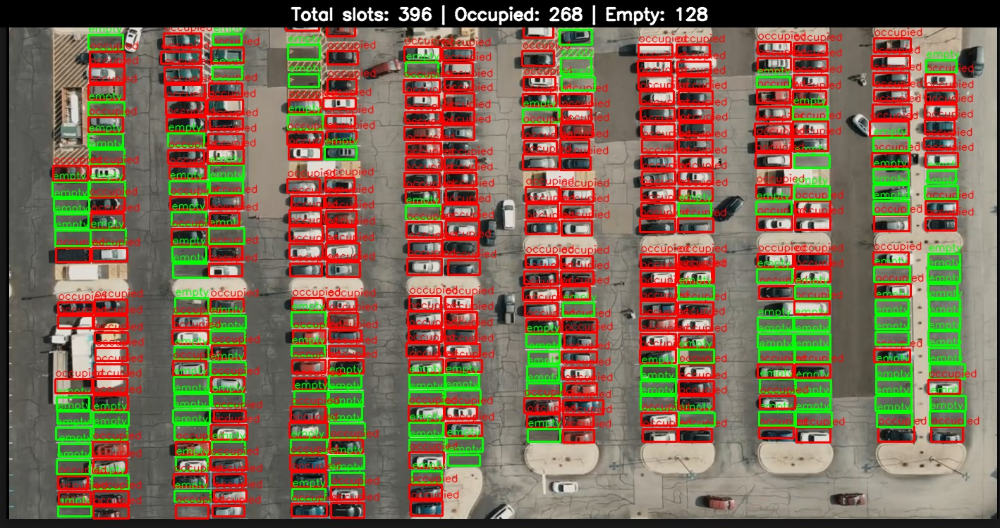

# parking_vision
# Parking Slot Occupancy Visualization and Counting

This project allows you to:
- **Count** the total, occupied, and empty parking slots in an image,
- **Visualize** parking slot annotations (boxes & class labels) on your image,
- **Display** results live and save the visualized image,
- **All from your YOLO-format manual annotation file (no model needed)**.

> **Note:** This project does not use a trained detection model. It relies on manual YOLO-format annotations for each image.

---

## Directory Structure

```
.
├── dataset/
│   ├── images/
│   │   └── sample_parking.jpg
│   └── labels/
│       └── sample_parking.txt
├── output/
│   └── visualized_slots_with_stats.jpg
├── visualize_and_count_slots.py
├── count_slots_from_label.py
├── .gitignore
└── README.md
```

---

## Requirements

- Python 3.7+
- Packages: `opencv-python`, `pandas`

Install requirements via:
```bash
pip install opencv-python pandas
```

---

## Annotation Format

- Label files are in YOLO format:  
  One line per parking slot:
  ```
  <class_id> <x_center> <y_center> <width> <height>
  ```
  - `class_id` = `0` for empty, `1` for occupied.
  - Coordinates are **normalized (0-1)**.

---

## How To Use

### 1. Prepare Your Image and Annotation

- Place your image in `dataset/images/` (e.g., `sample_parking.jpg`).
- Place your YOLO annotation in `dataset/labels/` with the same base name (e.g., `sample_parking.txt`).

### 2. Count Slots from Annotations

Use this to print and save the counts (no visualization):

run-
python count_slots_from_label.py


### 3. Visualize and Count (with Image Pop-up)

This script overlays bounding boxes, class labels, **shows counts at the top**, and pops up the image.  
It also saves the annotated image in `output/visualized_slots_with_stats.jpg`.

run-
python visualize_and_count_slots.py


> **Tip:** Change the filenames in the script if using different images/labels.

---

## Example Output



- The top bar displays:  
  `Total slots: X | Occupied: Y | Empty: Z`
- Each slot is labeled as `empty` (green) or `occupied` (red).

---

## Adding New Images

To process a new image:
1. Annotate the new image in YOLO format using a tool like [LabelImg](https://github.com/tzutalin/labelImg).
2. Place the `.jpg` and `.txt` files in the appropriate folders.
3. Update the script's `image_path` and `label_path` variables to point to your new files.
4. Run the visualization/count script again.

---

## Limitations

- **No automatic detection:** The script only works with manually labeled images.
- **Each new image must have a corresponding YOLO-format label file.**

---

## License

MIT License

---

## Author

- [Hemanth K ](https://github.com/hemxanthh)
